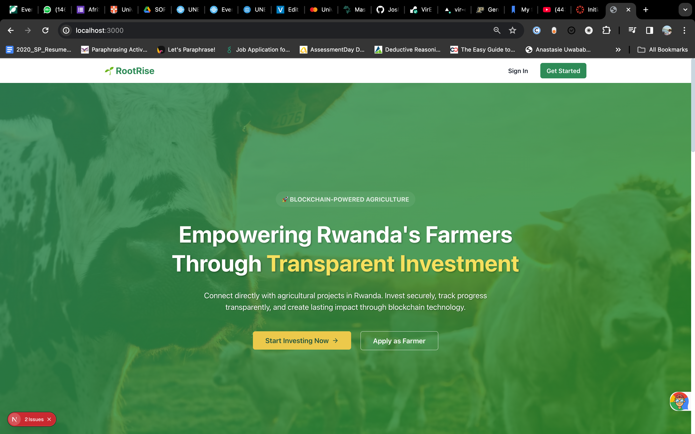
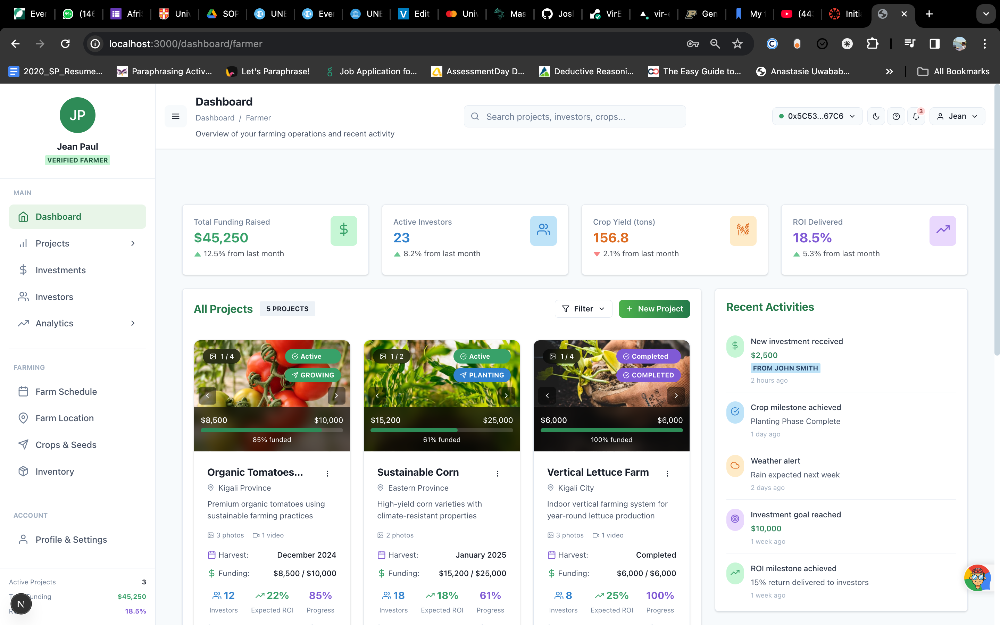
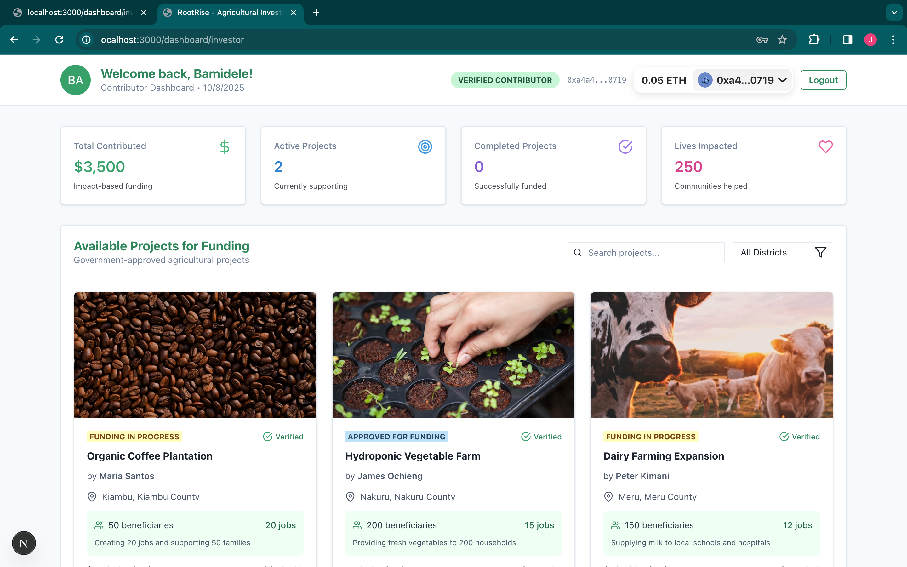
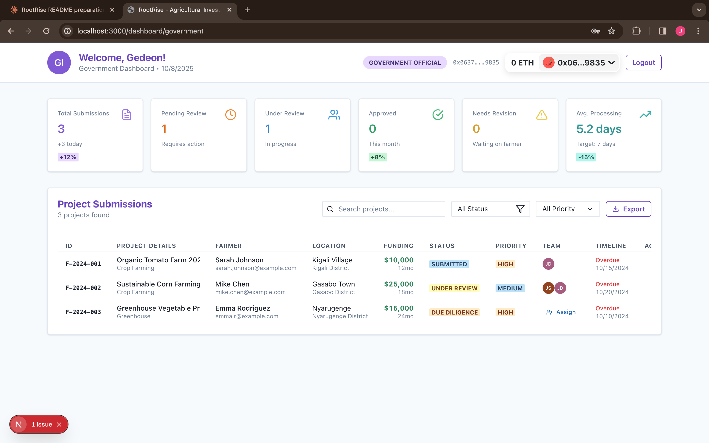
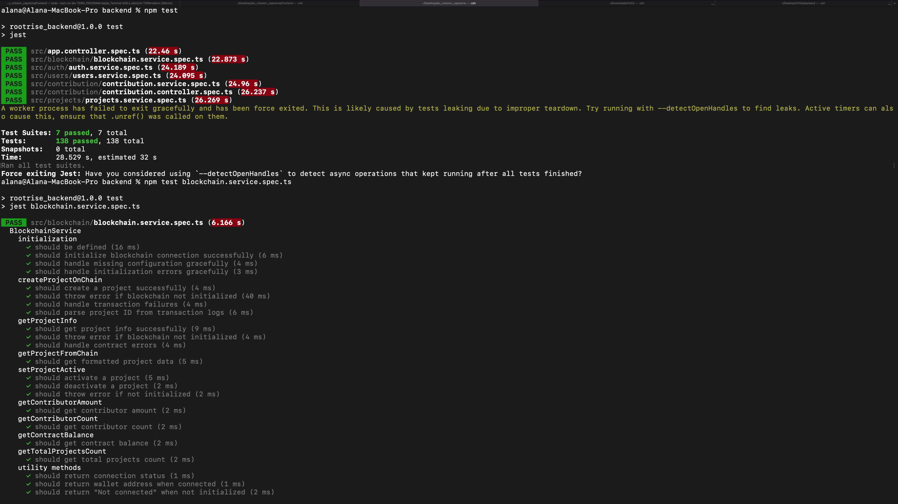
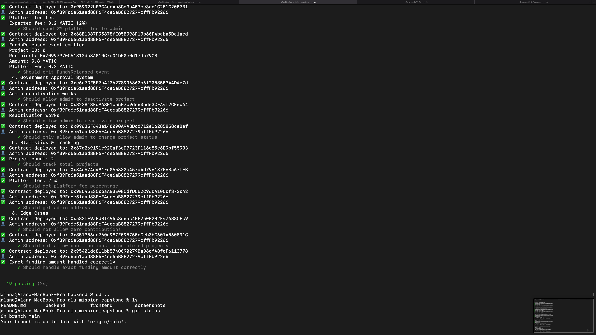
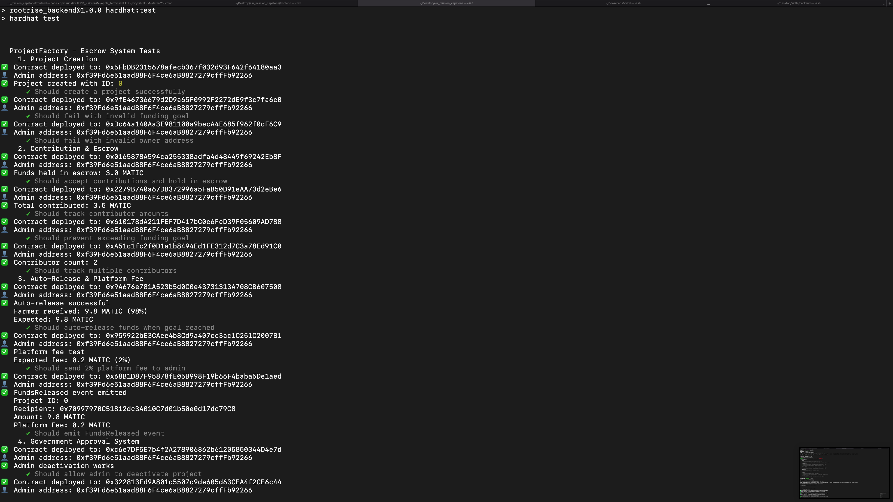
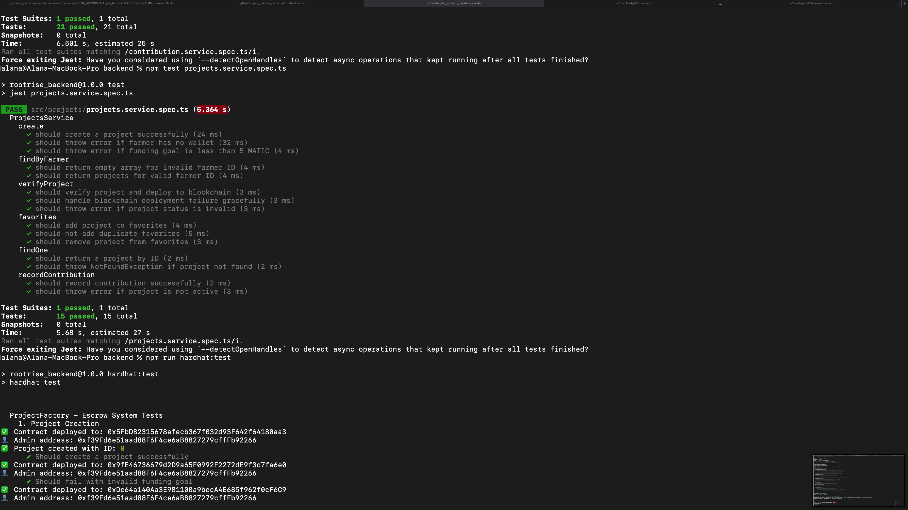
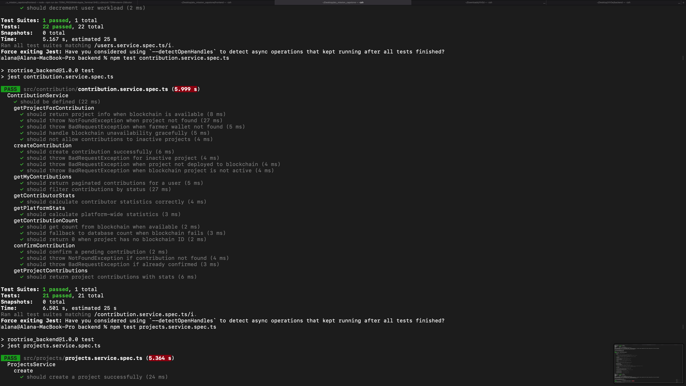
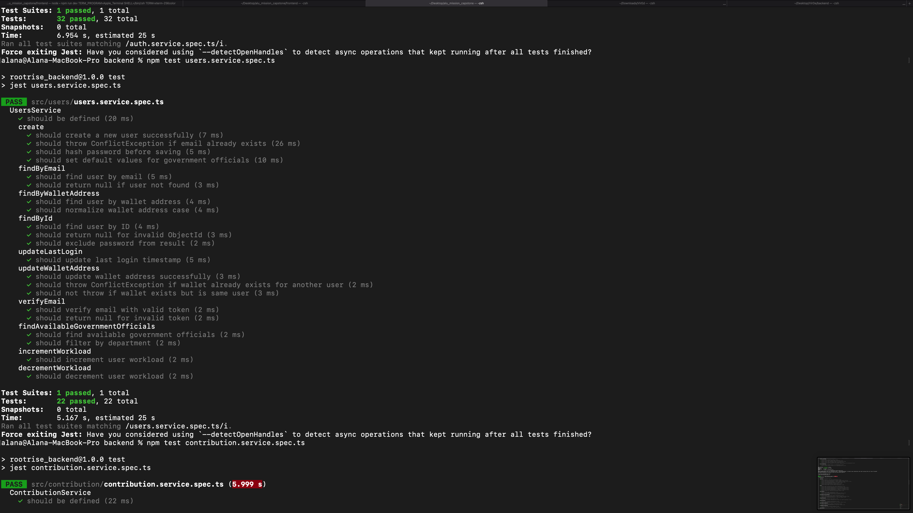

# RootRise 🌱

### Description
RootRise is a blockchain-powered agricultural funding platform connecting farmers with contributors. Built on Polygon blockchain for transparent, secure transactions. Government officials perform verification to ensure transparency and trust in project funding.

---

### GitHub Repository
[https://github.com/Joshua-Coded/alu_mission_capstone](https://github.com/Joshua-Coded/alu_mission_capstone)

---

### Live Deployment

**Frontend (Vercel)**
🔗 [https://alu-mission-capstone-zc78.vercel.app](https://alu-mission-capstone-zc78.vercel.app)

**Backend API (Render)**
🔗 [https://rootrise.onrender.com/api](https://rootrise.onrender.com/health)

**API Documentation (Swagger)**
📚 [https://rootrise.onrender.com/api](https://rootrise.onrender.com/api)

**Database:** MongoDB Atlas

---

## Implementation and Testing

### Testing Results

#### Functional Testing
- User Registration - Register as Farmer, Contributor, Government Official
- Project Creation - Farmers can create and submit projects
- Project Verification - Government officials can verify projects
- Blockchain Contribution - Contributors can fund projects with MATIC
- Role-based Access - Different dashboards for each user role

#### Performance Testing
- Frontend Load - Vercel Deployment
- API Response - Render Backend
- Blockchain TX - Polygon Mainnet

#### Cross-Browser Testing
- Chrome 119+
- Firefox 118+
- Safari 16+
- Edge 119+

### Analysis

**Objectives Achieved:**
- Blockchain integration with Polygon Mainnet
- Role-based authentication system
- Project funding with smart contract escrow
- Real-time transaction tracking
- Mobile-responsive design

**Technical Success:**
- Smart contract automatically releases funds upon goal achievement
- Gas-efficient transactions (~$0.01 per contribution)
- Secure JWT authentication with role-based permissions
- Cloudinary integration for image uploads

**Areas for Improvement:**
- Implement email notifications for project updates
- Add more detailed analytics dashboard
- Support for multiple cryptocurrency contributions

### Deployment

#### Deployment Plan
**Frontend (Vercel):**
- Connected to GitHub repository
- Automatic deployments on git push
- Environment variables configured
- Custom domain setup

**Backend (Render):**
- Node.js environment
- MongoDB Atlas connection
- Environment variables secured
- Auto-scaling enabled

**Database (MongoDB Atlas):**
- Cloud database cluster
- Automated backups
- Secure connection strings

#### Verification
- Frontend accessible at: https://alu-mission-capstone-zc78.vercel.app
- Backend API responding: https://rootrise.onrender.com/api
- Database connections stable
- Blockchain transactions confirmed on Polygonscan

---

## Screenshots

### Main Application Views





### Testing Evidence







---

### Setup Instructions

**Backend (NestJS)**
```bash
cd backend
npm install
npm run start:dev
```
Backend runs on `http://localhost:3001`

**Frontend (Next.js)**
```bash
cd frontend
npm install
npm run dev
```
Frontend runs on `http://localhost:3000`

---

### Technology Stack

**Frontend:**
- Next.js 14 with TypeScript
- Chakra UI for styling
- RainbowKit for wallet connection
- Wagmi for blockchain interactions
- Axios for API calls

**Backend:**
- NestJS with TypeScript
- MongoDB with Mongoose
- JWT Authentication
- Swagger/OpenAPI documentation
- Blockchain integration

**Blockchain:**
- Polygon Mainnet
- Smart Contract: `0x5387c3bC42304EbfCEFB0aAD1034753217C01b65`
- MATIC token for contributions

---

### Smart Contract Details

**Contract Address:** `0x5387c3bC42304EbfCEFB0aAD1034753217C01b65`

**Network:** Polygon Mainnet

**Features:**
- Secure fund escrow
- Automatic release upon funding goal
- Transparent transaction history
- Gas-efficient contributions

---

### Video Demo
🎥 [Watch Full Demo Video](https://drive.google.com/file/d/1FfsjCqrhErWnYkFz7QfIvZjwiPqr_QdJ/view?usp=sharing)

**Duration:** 10-15 minutes showcasing:
- User registration and role-based access
- Project creation and verification
- Blockchain contributions with MetaMask
- Real-time transaction tracking
- Smart contract interactions
- Platform administration features

---

### API Documentation

Comprehensive Swagger documentation available at:
📚 [https://rootrise.onrender.com/api](https://rootrise.onrender.com/api)

Includes:
- Authentication endpoints
- Project management APIs
- Contribution processing
- User management
- Blockchain integration endpoints

---

### Code Structure

```
alu_mission_capstone/
├── frontend/                 # Next.js application
├── backend/                  # NestJS API
├── screenshots/              # Application screenshots
└── README.md
```

---

### Contributing

1. Fork the repository
2. Create a feature branch
3. Commit your changes
4. Push to the branch
5. Open a Pull Request

---

